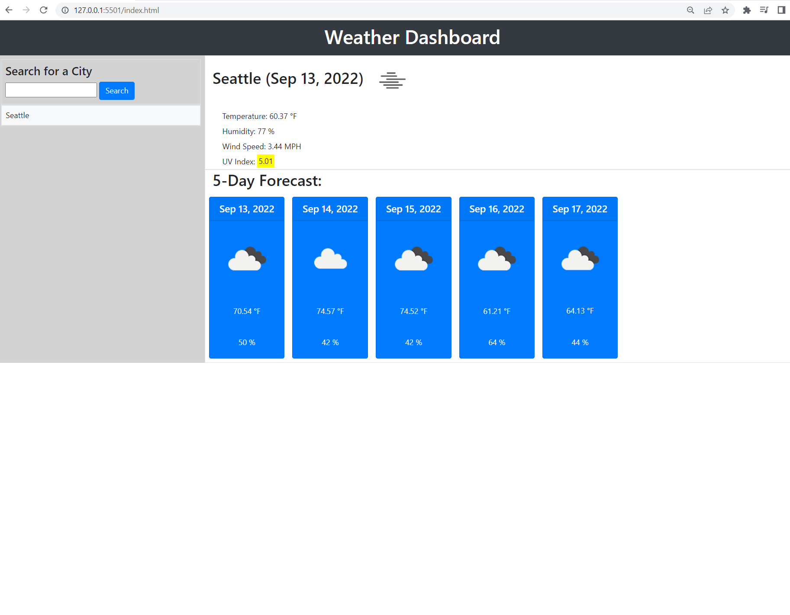

# Unit 4: Weather_Dashborder

## Description
A web-based dashboard built to show the current weather in a city of choice and the upcoming five (5) day forecast for that city. Using HTML, CSS, JavaScript, Open Weather APIs, Bootsrap API and Momnet.js 

## Table of Contents

- [Description](#description)
- [User Story](#user-story)
- [Acceptance Criteria](#acceptance-criteria)
- [Screenshot](#screenshot)
- [Using](#Using)


# User Story

```md
I want to use open source make weather forecast.
```

## Acceptance Criteria

```md
GIVEN I am taking a code quiz
WHEN I click the start button
THEN a timer starts and I am presented with a question
WHEN I answer a question
THEN I am presented with another question
WHEN I answer a question incorrectly
THEN time is subtracted from the clock
WHEN all questions are answered or the timer reaches 0
THEN the game is over
WHEN the game is over
THEN I can save my initials and my score
```
## Using

* HTML
* CSS
* Javascript
* Open Weather APIs 
* Bootstrap API
* Moment.js API


## Screenshot

screenshot for generate HTML webpages

 

## Deployed link

![Note Taker App] (https://drive.google.com'/file/d/1CO4TfmxIbAF89L4Y3TEJqE-JKNVez4n8/view) 

## Authors
JungHan Seo